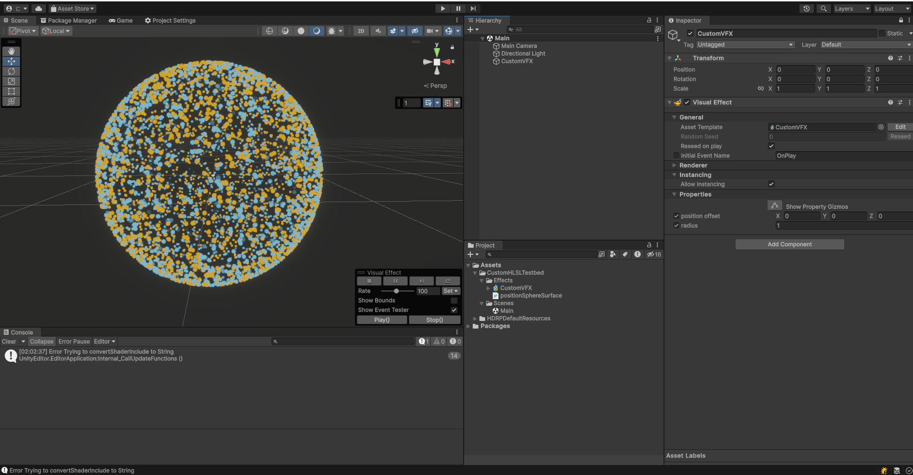
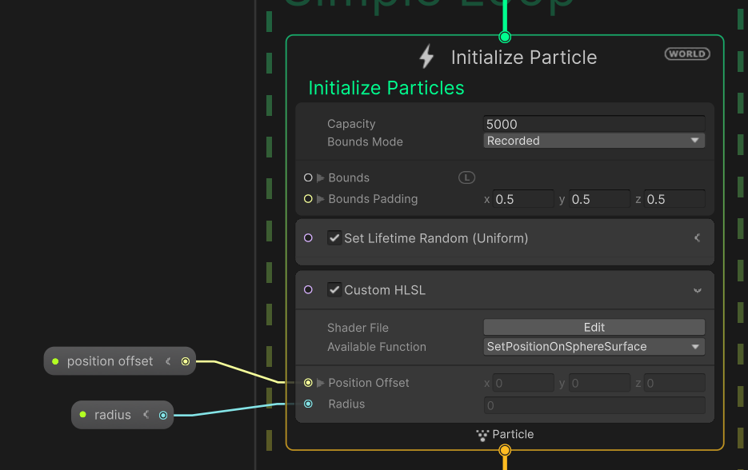

# VFX Graph Custom-HLSL-testbed

## About

VFX GraphのCustom HLSL Blockを使用したサンプルです。
球上にpositionをセットするコンテキストノードをHLSLで作って、Initializeコンテキストで使用しています。

## Environment

|           | env             |
|:----------|:----------------|
| OS        | Windows 10 Home |
| Unity     | 2023.2.0a22     |
| VFX Graph | 16.0.2          |

## Usage

`Assets/CustomHLSLTestbed/Scenes/Main.unity`を開いて再生します。

## Credit

[球の表面上の点をサンプリングするロジックに関する記事](https://qiita.com/aa_debdeb/items/e416ae8a018692fc07eb#%E7%90%83%E9%9D%A2%E4%B8%8A%E3%81%AE%E4%B8%80%E6%A7%98%E4%B9%B1%E6%95%B0-1)を参考にしています。

## Author

[@drumath2237](https://twitter.com/ninisan_drumath)